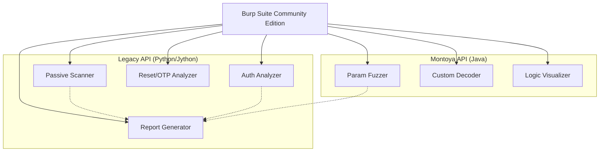

# Architecture Overview

The Burp Extensions Suite is designed as a modular monorepo containing both Java (Montoya API) and Python (Legacy API) extensions.

## System Diagram

## Modular Design
Each extension is self-contained in its own directory under `extensions/`, with its own build and test configurations.

## Shared Utilities
- `common/java`: Shared Java logic for the Montoya API extensions.
- `common/python`: Shared Python logic for the Legacy API extensions.
